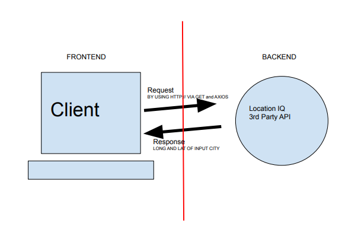
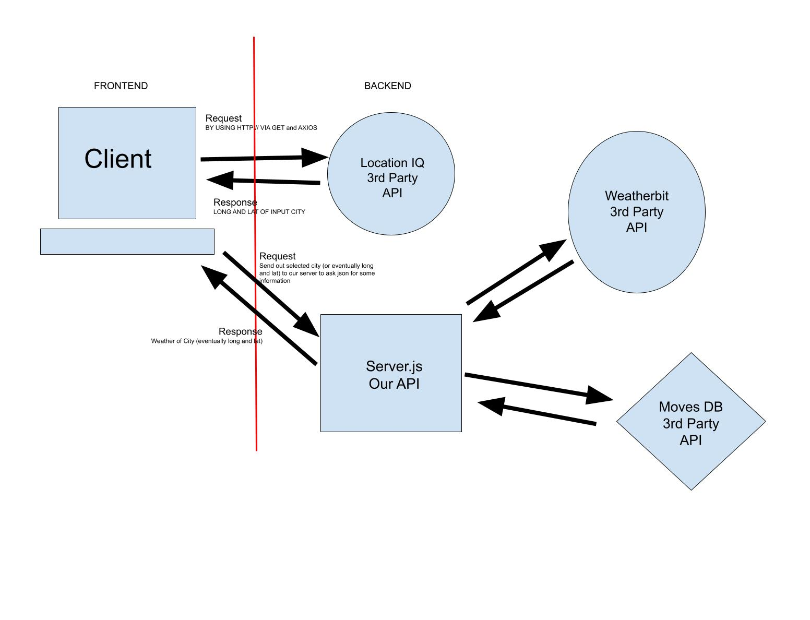

# Project Name

**Author**: brian sward
**Version**: 1.0.0

## Overview
This is a project for codefellows 301 class

## Getting Started
<!-- What are the steps that a user must take in order to build this app on their own machine and get it running? -->

## Architecture
<!-- Provide a detailed description of the application design. What technologies (languages, libraries, etc) you're using, and any other relevant design information. -->

## Change Log
<!-- Use this area to document the iterative changes made to your application as each feature is successfully implemented. Use time stamps. Here's an example:

01-01-2001 4:59pm - Application now has a fully-functional express server, with a GET route for the location resource. -->

## Credit and Collaborations
<!-- Give credit (and a link) to other people or resources that helped you build this application. -->

Time Estimates
For each of the lab features, make an estimate of the time it will take you to complete the feature, and record your start and finish times for that feature:

Name of feature: ________________________________

Estimate of time needed to complete: _____

Start time: _____

Finish time: _____

Actual time needed to complete: _____

Name of feature: lab class 09

Estimate of time needed to complete: 6 hours?

Start time: 2 pm

Finish time: 4:20

Actual time needed to complete: 2h 20 mins

Name of feature: lab class 10

Estimate of time needed to complete: 6 hours?

Start time: 4:10

Finish time: 

Actual time needed to complete: 